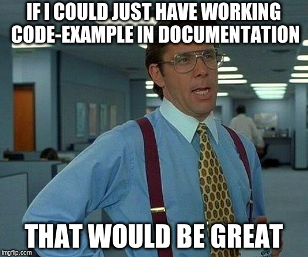
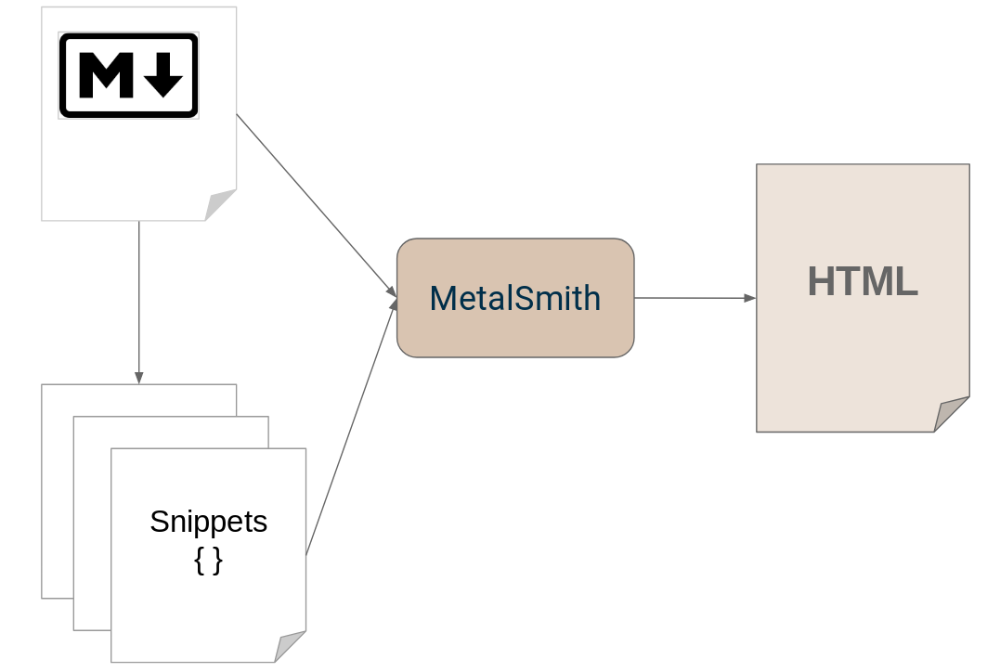
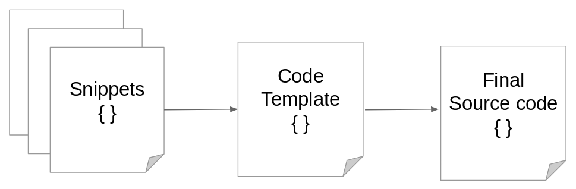
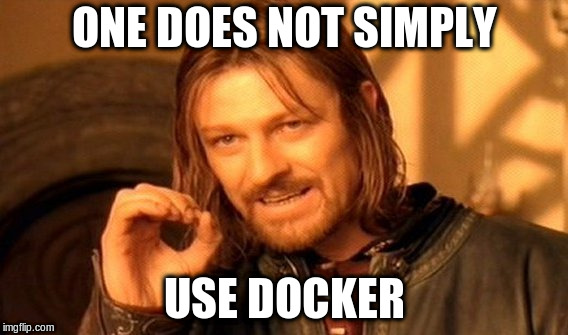
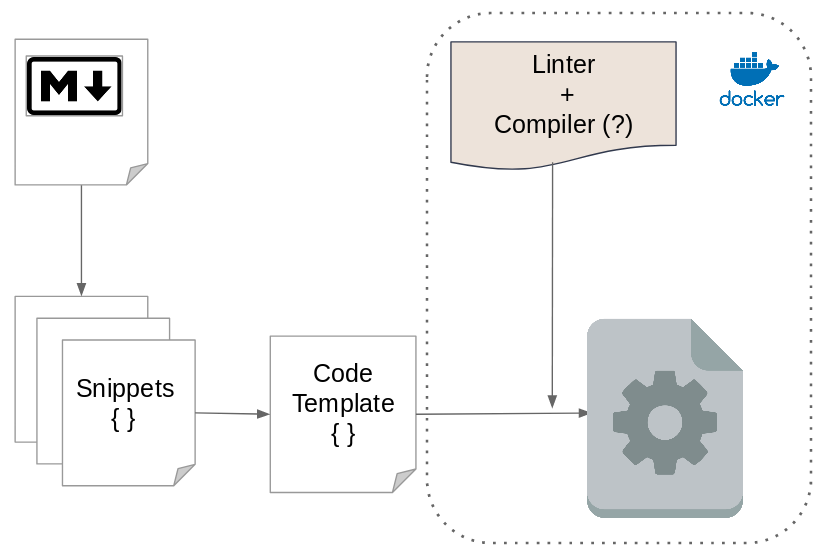
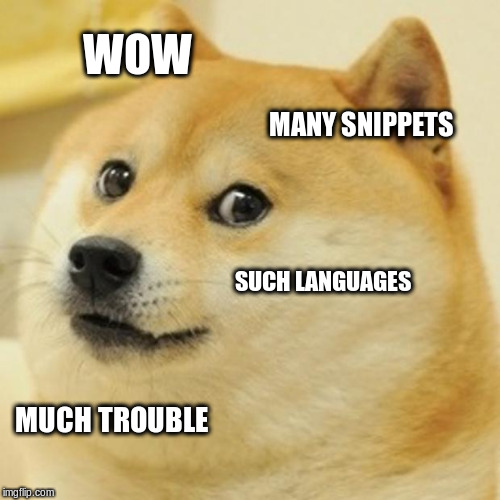
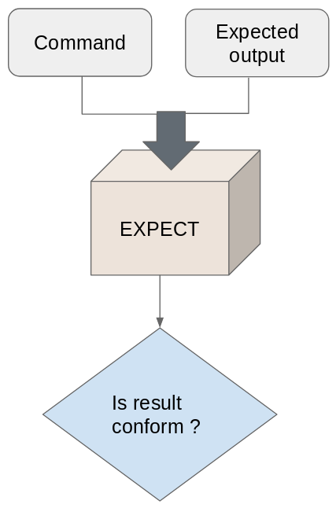
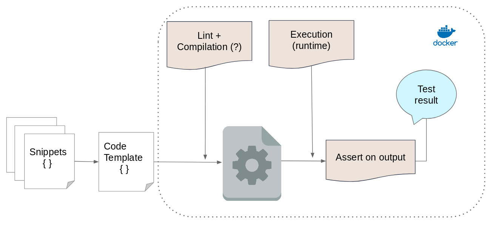
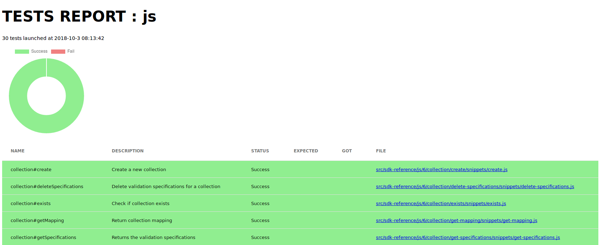
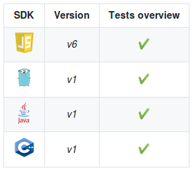

# The moment we decided to test our documentation snippets


At Kuzzle we love testing everything: our code as well as our UI, both with unit and end-to-end tests. And of course, everything must be automated. The only thing that remained untested was our code snippets in our documentation!

I've spent the last month developing a new test framework and I really want to share my experience with the community. In fact, I decided to write this article because when I searched the web for information about how to test code snippets... I found nothing!


## How it all started ?

So, let's begin with a little story. At kuzzle we develop many SDKs in many languages to help developers using our product. When you say SDK, you say documentation you have to write. And it's not an easy task!

With the team we do meetings and workshops to prioritize points in our roadmap. And this time the subject of our meetings was “shame”! The week before, we redirected a developer asking for help to our documentation. He copy/pasted the snippet, ran the code... Nothing happened. He just got a bunch of errors. After trying it ourselves, we had to admit our docs were broken. In fact, we made changes in our SDKs and we forgot to update the corresponding documentation.



All the team agreed on one point. We needed to rewrite our documentation! We also decided to perform integration tests on our snippets to make our documentation more reliable. And also preventing breaking changes with the releases of the next versions of our SDKs.

This task seemed to be my job. Because all eyes turned to me when the decision was taken. And above all I'm in charge of maintaining and improving the documentation. At this point I had no idea of how I could make this miracle happen. My first reflex was to search on the web: nothing. I finally found one article speaking about testing documentation, but very briefly and it concludes that is a very good idea but also a very complicated one.

So here I am, I have to develop an end to end testing framework plugged on our documentation. It has to be easy for copywriters to write snippets and also easy to tests them in each language our SDKs was released. With the help of our favorite scrum master (special thanks to Eric), we sliced this labor in atomic tasks: things are about to get real!


## Writting documentation and snippets has to be easy

My first task was to create a system that made snippet writing easy. We use Metalsmith to generate our documentation website. It's a great tool and it uses Markdown to generate static HTML pages. Our current documentation use snippets written directly in Markdown. The First step was to take out the snippets and put them in a separate file with the corresponding extension for each language (mySnippet.js, mySnippet.go …). And after that, I just had to develop a tiny Metalsmith plugin to insert the code snippet in markdown. The plugin seeks the [snippet=feature_name] tag within the markdown files and replaces it with the snippets it finds in the snippet folder.

We are now able to generate a static HTML website from a markdown templating system using real source code files as example snippets.



## Executing these snippets

By definition, snippets are just a piece of code and they aren't often able to be played without a context (other pieces of code). We imagined a template system in which snippets content will be injected.

Here, an example of a snippet in javascript

```js
//Connects to Kuzzle
kuzzle
  .connect()
  .then(() => {
    console.log('Successfully connected');
  })
  .catch(error => {
    console.error(error.message);
  });
```

And here a code template

```js
// load the Kuzzle SDK module
const { Kuzzle } = require('kuzzle-sdk');

// instantiate a Kuzzle client
const kuzzle = new Kuzzle('websocket', {
  host: 'kuzzle',
  autoReconnect: false
});

// snippet will be injected here
[snippet-code]

```

The tag [snippet-code] in the template will be replaced by the snippet and will form a fully executable source code file.




At this point, we have many source files, in many languages. The first version of this new documentation system can support snippets test for Javascript, Java, C++ and Go. Some languages are interpreted, others compiled. All of them need their dedicated toolchain !



The first thing I did was creating a Dockerfile for each supported language containing the whole toolchain to compile/interpret the generated file.We also decided to add a linter in each container to unify the coding style and minimize errors (you can see an exemple of a dockerfile [here](https://github.com/kuzzleio/documentation-V2/blob/master/docker/java)).

At this point, we could run each snippet in its dedicated container and things seem to work perfectly!!




## Implementing test system



Next task was to implement the test system properly speaking. How to test all of these languages with one test definition? Finally that's simple: all languages can write in the standard output. Javascript has `console.log`, C++ `std::cout`, Go `fmt.Println` etc, etc ... With the help of my teammates we decided to use **Expect** to check if the tests are passed or not.

> *From wikipedia :* Expect is an automation and non-regression testing tool written by Don Libes as an extension to the Tcl scripting language to test interactive applications like telnet, ftp, passwd, fsck, rlogin, ssh, or others.

Running tests is simple, tell Expect the command to execute and our assertions on the resulting standard output.




For writing these tests, we opted for a YAML file in front of the snippets files. It simple to write, simple to read and simple to parse. They have to describe the test, give an expected string and the template we want to use. We also imagined a system of hooks (before and after) like in every test framework to execute some script for cleaning or other operations.


```yaml
name: kuzzle-connect
description: Connects the SDK to Kuzzle
hooks:
  before: 
  after: 
template: default
expected: Successfully connected
```

I found a cool Node.js package on NPM named [Nexpect](https://github.com/nodejitsu/nexpect). Then, I wrote a Node.js script for running tests for each language. For an easy implementation of every languages I made an abstract Tester class and I implement a children class for each language with `lint` and `run` command. In this way if we want to add another language for our SDKs it's very easy to create a new `Tester` by just extending the mother tester class and only override the commands to be executed for this new language.

Here, the abstract class

```js
class Tester {

  constructor () {
    if (new.target === Tester) {
      throw new TypeError("Cannot construct Tester instances directly");
    }
  }
  
  execLintCommand () {
    // return a promise will executing 
    // this.lintCommand added in childrens class
  }
  
  execRunCommand () {
    // return a promise will executing 
    // this.runCommand added in childrens class
  }
  
  // [...]
}
```

And Here, the extended class for testing snippets in Go

```js
class GoTester extends Tester {
  
  constructor() {
    super();
    this.language = 'go';
    this.runCommand = 'go run';
    this.lintCommand = 'golint';
  }

}
```

And finally the last schema with the full process



## Continuous integration and validation

The last but not least step was to put all of this process in a CI/CD workflow. At Kuzzle we use a Git-flow process. Each change in our documentation leads to a pull-request. And for each pull-request, we run all the tests for each language in Travis CI. I also added a report system to easily see which test was failed.



Additionally, Alex our team's devOps guy (aka "AWS lambda gardener") developed a tool in Go to automatically add a comment to github in each pull-request to add a summary of the tests reports, which makes it even easier to detect a problem in our documentation before send it to production



[you could add credits to Alex here](https://github.com/alexandrebouthinon/kuttlefish).


## Conclusion

In conclusion, it was a great experience! And of course, not only mine. All the Kuzzle team got involved in the development of our new documentation system. We had a lot of meetings to decide what was the best way to implement all of this process.

At first it was just a P.O.C and, as we worked more and more on it, the system became more and more reliable! To the point that we are planning to support more languages. We are currently dealing with problems in the workflow, like how to take into account the different versions of the SDKs. We were forced to change a lot of points throughout the development to best meet our needs. On top of that, we try to reduce the difficulty of writing the documentation. For example, Adrien developed an awesome scaffolding tools that greatly improves drafting.


Now, our new documentation is under progress! And you can see the results [here](docs-v2.kuzzle.io)