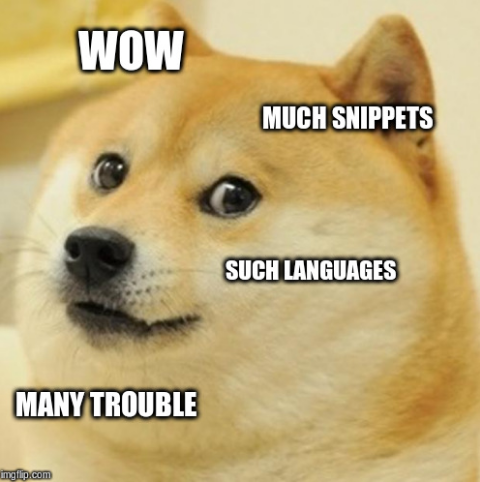

# The moment we decided to test our documentation snippets


At Kuzzle we love testing everything: our code, our U.I, unitary, functionally and obviously automatically ... The last things remaining untested was our code snippets in our documentation!

I've passed the last month to develop a tiny tests framework. And I really want to share my experience with the community. In fact, I decided to write this article because when I try to find some blogs or something else deal with this subject, I found nothing!  


## How it all started ?

So, let's begin with a little story. At kuzzle we develop many SDKs in many languages to help developers using our product. And who say SDKs, say we have to write their documentation. And it's not an easy task!

With the team we do meetings and workshops to decide important points and priorities in our road-map. And this time the subject of our meetings was “shame”! Indeed, we tried to help a developer using our tools and redirect him to our documentation. He tries to copy/paste some code snippets ... run his code ... and ... nothing happens ... only a huge amount of error messages. After many try, we were forced to admit it: parts of our documentation was broken. In fact, we made changes in our SDKs and we forgot to update the corresponding documentation.


All the team agreed on one points. We need to refund our documentation! We also decide that we want our SDKs snippets have to be tested functionally to make our documentation easier to maintains. And also preventing breaking changes with the releases of the next versions of our SDKs.

This task seemed to be my job. Because all eyes turned to me when the decision was taken. And above all I'm in charge to maintain and improve the documentation. At this point I have no idea of how I can make this miracle happen. My first reflex was to search on the web: nothing. I finally found one article speaking about testing documentation, but very briefly and it concludes that is a very good idea but al

So here I am, I have to develop an end to end testing framework plugged on our documentation. Its have to be easy for redactors to write snippets and also easy to tests them in each language our SDKs was released. With the help of our favorite scrum master (special thanks to Eric). We slice this labor in many tasks. Things began to be real!


## Writting documentation and snippets has to be easy

The first task I have to make is to create a system easy to use for writing snippets. We use Metalsmith to generate our documentation website. It's a great tool and it uses Markdown to generate static HTML website. Our actual documentation use snippets written directly in Markdown. First, step was to take out the snippets and put them in a separate file with the corresponding extension for each language (mySnippet.js, mySnippet.go …). And after that, I just had to develop a tiny Metalsmith plugin to insert snippet code in markdown. With this plugin, when we have to write a snippet, we just need to add a special tag in the markdown: **“[snippet=feature_name]”** and the plugin automatically inject the content of all the snippets files contained in the **snippet** folder to the generated HTML.

Here we are, we have a working markdown templating system with real source code files as  snippets examples, able to generate HTML.


## Executing these snippets

By definition, snippets are just a piece of code and they aren't often able to be played without a context (other pieces of code). We imagined a template system in which snippets content will be injected.

Here, an example of a snippet in javascript

```js
//Connects to Kuzzle
kuzzle
  .connect()
  .then(() => {
    console.log('Successfully connected');
  })
  .catch(error => {
    console.error(error.message);
  });
```

And here a code template

```js
// load the Kuzzle SDK module
const { Kuzzle } = require('kuzzle-sdk');

// instantiate a Kuzzle client
const kuzzle = new Kuzzle('websocket', {
  host: 'kuzzle',
  autoReconnect: false
});

// snippet will be injected here
[snippet-code]

```

The tag **[snippet-code]** in the template will be replaced by the snippet and will form a full context file which can be executed.


At this point, we have many source files, in many languages. First version of this new documentation system can support snippets test for Javascript, Java, C++ and Go. Some languages are interpreted, others compiled. All of them need their dedicated toolchain !


First thing I do is to create a DockerFile for each language implemented with all the toolchain to compile/interpret generated file. Also, we decided to add a linter in each container for each language to be sure to have a correct syntax and minimize source of errors (you can see an exemple of a dockerfile [here](https://hub.docker.com/r/kuzzleio/documentation-v2/~/dockerfile/)).

At this point, we had some docker containers able to run code for their dedicated language and things seem to work perfectly!


## Implementing test system



Next task was to implement the test system properly speaking. How to test all of these languages with one test definition? Finally that's simple, all languages can write in the standard output. Javascript has his `console.log`, C++ his `std::cout`, Go his `fmt.Println` etc, etc ... With the help of my teammates we decided to use **Expect** to check if the tests are passed or not.

> *From wikipedia :* Expect is an automation and non-regression testing tool written by Don Libes as an extension to the Tcl scripting language to test interactive applications like telnet, ftp, passwd, fsck, rlogin, ssh, or others.

Running tests is simple, we give to expect a command to execute, also a string expected and it can do assertion on the result of the command.


For writing these tests, we opted for a YAML file in front of the snippets files. It simple to write, simple to read and simple to parse. They have to describe the test, give an expected string and the template we want to use. We also imagined a system of hooks (before and after) like in every test framework to execute some script for cleaning or other operations.

```yaml
name: kuzzle-connect
description: Connects the SDK to Kuzzle
hooks:
  before: 
  after: 
template: default
expected: Successfully connected
```

I found a cool Node.js package on NPM named [Nexpect](https://github.com/nodejitsu/nexpect). Then, I wrote a Node.js script for running tests for each language. For an easy implementation of every languages I make an abstract Tester class and I implement a children class for each language with lint and run command. In this way if we want to add another language for our SDKs it's very easy to just create a class and extend it to the mother tester class and only override commands to be executed for this new language.

Here, the abstract class

```js
class Tester {

  constructor () {
    if (new.target === Tester) {
      throw new TypeError("Cannot construct Tester instances directly");
    }
  }
  
  execLintCommand () {
    // return a promise will executing 
    // this.lintCommand added in childrens class
  }
  
  execRunCommand () {
    // return a promise will executing 
    // this.runCommand added in childrens class
  }
  
  // [...]
}
```

And Here, the extended class for testing snippets in Go

```js
class GoTester extends Tester {
  
  constructor() {
    super();
    this.language = 'go';
    this.runCommand = 'go run';
    this.lintCommand = 'golint';
  }

}
```

And finally the last schema with the full process


## Continuous integration and validation

The last step and not the least was to put all of this process in a CI/CD workflow. At Kuzzle we use a Git-flow process. Each change in our documentation leads to a pull-request. And for each pull-request, we use Travis CI to run all containers for each language. I also add a report system to easily see which test was failed.


Additionally, Alex our team's devOps guy(aka "AWS lambda gardener") developed a tool in Go to automatically add a comment to github in each pull-request to add a summary of the tests reports, which makes it even easier to detect a problem in our documentation before send it to production


[here](https://github.com/alexandrebouthinon/kuttlefish) a link to the repository of this tool (named "Kuttlefish").


## Conclusion

In conclusion, it was a great experience! And of course, not only mine. All the Kuzzle team was very implicated in the development of our new documentation system. We made many meetings to deliberate to the better way to implement all of this process.

At first it was just a P.O.C and as we go along everything begin to works very well! We begin to support more languages. Also, we begin to find problems in the workflow like how to test documentation with many versions of our SDKs. We were forced to change things along the way to answer as well as possible to our needs. On top of that, we try to reduce the difficulty of writing the documentation. For example, Adrien, another member of the Kuzzle team developed a scaffolding tool which greatly improves drafting.

Now, our new documentation is under progress! And you can see the results [here](docs-v2.kuzzle.io)