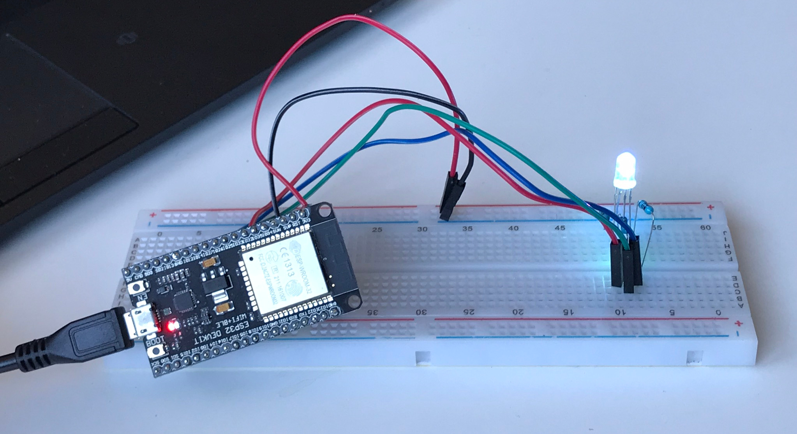
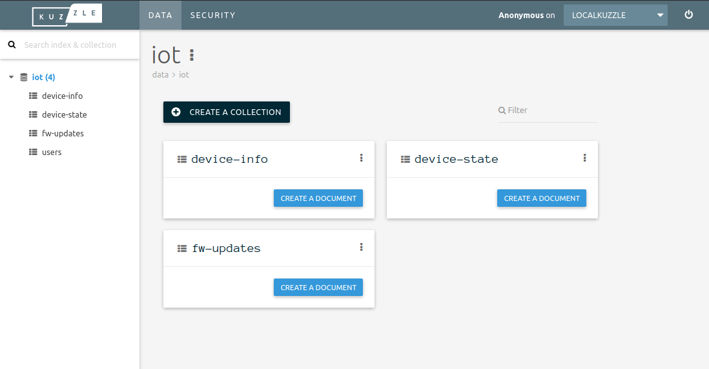
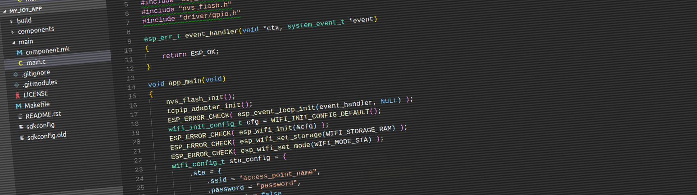
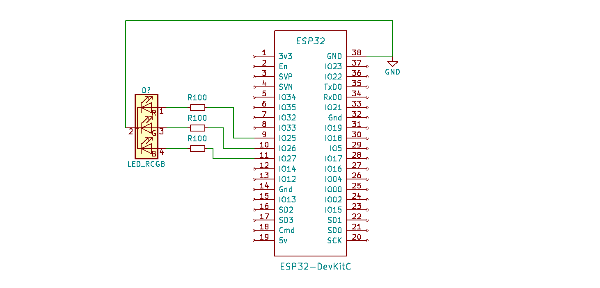
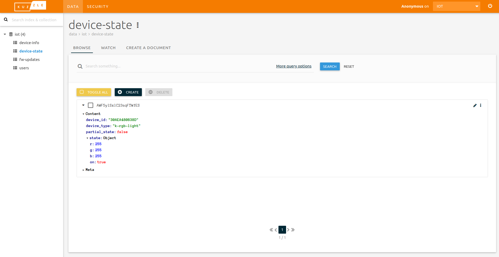
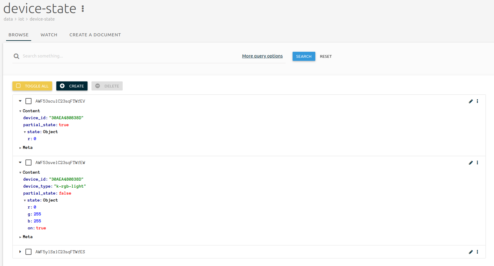

# USE KUZZLE AS AN IOT BACKEND WITH ESP32 MCU


## Intro: Use Kuzzle as an IoT backend With ESP32

Kuzzle is an open-source backend suite that can be installed on-premises and includes a multi-protocol API that can be used to integrate IoT devices.

In this article we will show you how to develop an IoT application using an ESP32 module and Kuzzle Backend, communicating using MQTT.

Specifically, we will build a basic IoT device featuring a RGB LED, and change its colors using Kuzzle Admin Console.

## Installing Kuzzle Backend and Kuzzle Admin Console

First you will need to install Kuzzle Backend, an open source IoT backend solution, on your favorite Linux distribution.

The following guide will allow you to quickly run a Kuzzle Backend instance: [Getting Started](http://docs.kuzzle.io/guide/getting-started).

By default, Kuzzle does not support MQTT communication.  
Fortunately, Kuzzle features an extendable protocol architecture: all you need is to install our official [MQTT Protocol](https://github.com/kuzzleio/protocol-mqtt) to add MQTT capabilities to Kuzzle.  

Our documentation contains the necessary instructions to add a new network protocol to Kuzzle: [Install a Protocol](https://docs.kuzzle.io/plugins-reference/protocols#installing-a-protocol)


Then you can install Kuzzle Admin Console or use the online version. This is the administration tool that allows you to manage and browse your data. The online version of Kuzzle Admin Console can be configured to connect to your local Kuzzle Backend (although it is hosted online, all the code to access your Kuzzle Backend instance will run locally in your browser, thus there is no need for NAT).

If you want to install a local Kuzzle Admin Console instance on your machine, the instructions can be found on github: <https://github.com/kuzzleio/kuzzle-admin-console>.



## What you need

To follow this tutorial, you will need the following components:

* 1 × ESP32 DevKit C
* 1 × USB A / micro USB B cable
* 1 × PC running Linux
* 1 × RGB LED
* 3 × 100 ohm resistor

## Preparing the Kuzzle IoT Environment

Our IoT application will require a simple setup:

* an "iot" index (an index is where we will store collections of data).
* a set of collections to store device data (device state and more...)
* data mappings for each collection the define the data type for fields we store.



To deploy this basic setup to your Kuzzle Backend I have prepared a script available here: [iot-deploy](./iot-deploy)

Follow the instructions in the README file to deploy your IoT environment.

Once you have run the script, open Kuzzle Admin Console, and you should see an **iot** index that contains these 3 collections:

**device-info**: can contain static information about a device like the user it belongs to, its friendly name, and so on.

**device-state**: keeps track of the device state history. Will also be used to subscribe to state changes.

**fw-update**: this collection is used to keep track of available firmware updates.
For this first tutorial, we will only use the ̀-state collection.

## Preparing the ESP32 Development Environment

The first step is to install the ESP32 toolchain and SDK.

You can follow these instructions to install the tools required to build and deploy firmware to your ESP32 module: <https://esp-idf.readthedocs.io/en/latest/get-started/index.html>

Once the toolchain and the SDK are installed and ready to use, you can create your project.

Espressif provides an application template you can clone from Github: <https://github.com/espressif/esp-idf-template>

``` console
$ git clone https://github.com/espressif/esp-idf-template my-connected-rgb-light
```

Make sure you are able to build and flash the application to your ESP32 module.



## Dependencies

To allow your application to communicate with Kuzzle Backend, you will need 2 components.

**esp-mqtt**: MQTT communication layer library for ESP32: <https://github.com/espressif/esp-mqtt>

**kuzzle-esp32**: A convinent component that takes care of communication with Kuzzle over MQTT. <https://github.com/kuzzleio/kuzzle-esp32>.

Components must be located in the `components` subfolder of your project as explained in [Espressif build system](https://docs.espressif.com/projects/esp-idf/en/latest/api-guides/build-system.html) documentation.

To add the **esp-mqtt** and **kuzzle-esp32** components, you can clone them using the following commands in you project folder:

``` console
$ git submodule add https://github.com/espressif/esp-mqtt components/esp-mqtt
$ git submodule add https://github.com/kuzzleio/kuzzle-esp32 components/kuzzle-esp32
```

Your project folder structure should look like this:
``` console
$ tree -d -L 2
.
├── components
│   ├── esp-mqtt
│   └── kuzzle-esp32
└── main
```

<!-- In this tutorial, for the sake of simplicity, there is no security layer to Kuzzle's MQTT protocol. So we need to disable security from the `esp-mqtt` component. In `components/espmqtt/include/mqtt_config.h`, change the line -->

<!-- ``` c
#define CONFIG_MQTT_SECURITY_ON 1
```

to

 ``` c
 #define CONFIG_MQTT_SECURITY_ON 0
``` -->

## Wiring the RGB LED to ESP32 DevKit C


The RGB LED will be driven by GPIO 25, 26 and 27.

## Application Code

### Setup WIFI

The first step is to provide the Wifi credentials so that the device is able to connect to your local network. In `app_main()` update the following code with the credentials for your WIFI access point:

``` c
 wifi_config_t sta_config = {
   .sta = {
     .ssid = "your_access_point_name",
       .password = "your_ap_password",
       .bssid_set = false
   }
 };
```

### Initialize Kuzzle

Once connected to the WIFI, we can initialize the Kuzzle Backend library:

``` c
void on_light_state_update(cJSON* state); // State change from Kuzzle callback
static kuzzle_settings_t _k_settings = {
                    .host  = "this_ip_addr_hosting_kuzzle",
                    .port  = 1883,
                    .device_type  = "my-rgb-light",  // Any string that identifies you device type
                    .username = KUZZLE_IOT_DEVICE_USERNAME,
                    .password = KUZZLE_IOT_DEVICE_PASSWORD,
                    .on_fw_update_notification = NULL,
                    .on_device_state_changed_notification = on_light_state_update
};

esp_err_t event_handler(void* ctx, system_event_t* event)
{
    switch (event->event_id) {
        case SYSTEM_EVENT_STA_GOT_IP: {
            ESP_LOGI(TAG, "<<<<<<< GOT IP ADDR >>>>>>>>>");
            memcpy(_k_settings.device_id, uid, sizeof(k_device_id_t));
            kuzzle_init(&_k_settings);
        } break;
        case SYSTEM_EVENT_STA_DISCONNECTED: {
            ESP_LOGW(TAG, "Disonnected from AP...reconnecting...");
            esp_wifi_connect();
        } break;
        default:
            ESP_LOGW(TAG, ">>>>>>> event_handler: %d\n", event->event_id);
    }
    return ESP_OK;
}
```

### LED Driving Code

First we need to initialise the LED driver

``` C
// -- Hardware definition --
#define LEDC_MAX_PWM 8190
#define LEDC_TRANSITION_TIME 250 // ms
#define RED_PWM_CHANNEL LEDC_CHANNEL_0
#define RED_GPIO_NUM GPIO_NUM_25
#define GREEN_PWM_CHANNEL LEDC_CHANNEL_1
#define GREEN_GPIO_NUM GPIO_NUM_26
#define BLUE_PWM_CHANNEL LEDC_CHANNEL_2
#define BLUE_GPIO_NUM GPIO_NUM_27

static void _setup_light()
{
    static ledc_timer_config_t ledc_timer = {
        .bit_num    = LEDC_TIMER_13_BIT,    // set timer counter bit number
        .freq_hz    = 5000,                 // set frequency of pwm
        .speed_mode = LEDC_HIGH_SPEED_MODE, // timer mode,
        .timer_num  = LEDC_TIMER_0          // timer index
    };
    ledc_timer_config(&ledc_timer);

    static ledc_channel_config_t red = {
        .gpio_num   = RED_GPIO_NUM,
        .channel    = RED_PWM_CHANNEL,
        .speed_mode = LEDC_HIGH_SPEED_MODE,
        .intr_type  = LEDC_INTR_DISABLE,
        .timer_sel  = LEDC_TIMER_0,
        .duty       = 0 // LEDC channel duty, the duty range is [0, (2**bit_num) - 1],
    };

    static ledc_channel_config_t green = {
        .gpio_num   = GREEN_GPIO_NUM,
        .channel    = GREEN_PWM_CHANNEL,
        .speed_mode = LEDC_HIGH_SPEED_MODE,
        .intr_type  = LEDC_INTR_DISABLE,
        .timer_sel  = LEDC_TIMER_0,
        .duty       = 0 // LEDC channel duty, the duty range is [0, (2**bit_num) - 1],
    };

    static ledc_channel_config_t blue = {
        .gpio_num   = BLUE_GPIO_NUM,
        .channel    = BLUE_PWM_CHANNEL,
        .speed_mode = LEDC_HIGH_SPEED_MODE,
        .intr_type  = LEDC_INTR_DISABLE,
        .timer_sel  = LEDC_TIMER_0,
        .duty       = 0 // LEDC channel duty, the duty range is [0, (2**bit_num) - 1],
    };

    ledc_channel_config(&red);
    ledc_channel_config(&green);
    ledc_channel_config(&blue);
    ledc_fade_func_install(0);
}
```

The device will keep track of its current state (ON/OFF, RGB color...)

``` C
typedef struct light_state {
    uint8_t r;
    uint8_t g;
    uint8_t b;
    bool on; ///< true if light is on, false if off
} light_state_t;

static light_state_t _light_state = {.r = 0xFF, .g = 0xFF, .b = 0xFF, .on = true};
```

### Applying new state from Kuzzle to hardware

When the state of the RGB light is changed from Kuzzle Backend, we will receive a callback and need to update the LED driver accordingly:

```C
void on_light_state_update(cJSON* jresponse)
{
    cJSON* jstatus = cJSON_GetObjectItem(jresponse, "status");
    assert(jstatus != NULL);
    int16_t status_value = jstatus->valueint;
    ESP_LOGD(TAG, "Kuzzle response: status = %d", status_value);

    if (status_value == K_STATUS_NO_ERROR) {
        cJSON* jresult = cJSON_GetObjectItem(jresponse, "result");
        cJSON* jsource = cJSON_GetObjectItem(jresult, "_source");
        cJSON* jstate  = cJSON_GetObjectItem(jsource, "state");

        cJSON* r = cJSON_GetObjectItem(jstate, "r");
        if (r != NULL)
            _light_state.r = r->valueint;

        cJSON* g = cJSON_GetObjectItem(jstate, "g");
        if (g != NULL)
            _light_state.g = g->valueint;

        cJSON* b = cJSON_GetObjectItem(jstate, "b");
        if (b != NULL)
            _light_state.b = b->valueint;

        cJSON* on = cJSON_GetObjectItem(jstate, "on");
        if (on != NULL)
            _light_state.on = on->valueint;

        ESP_LOGD(TAG,
                 "New light state: r= 0x%02x, g= 0x%02x, b= 0x%02x, on = %s",
                 _light_state.r,
                 _light_state.g,
                 _light_state.b,
                 _light_state.on ? "true" : "false");
        _update_light();
    }
}

static void _update_light()
{
    uint32_t r_duty = _light_state.on ? (LEDC_MAX_PWM * _light_state.r) / 0xFF : 0;
    uint32_t g_duty = _light_state.on ? (LEDC_MAX_PWM * _light_state.g) / 0xFF : 0;
    uint32_t b_duty = _light_state.on ? (LEDC_MAX_PWM * _light_state.b) / 0xFF : 0;

    ledc_set_fade_with_time(LEDC_HIGH_SPEED_MODE, RED_PWM_CHANNEL, r_duty, LEDC_TRANSITION_TIME);
    ledc_set_fade_with_time(LEDC_HIGH_SPEED_MODE, GREEN_PWM_CHANNEL, g_duty, LEDC_TRANSITION_TIME);
    ledc_set_fade_with_time(LEDC_HIGH_SPEED_MODE, BLUE_PWM_CHANNEL, b_duty, LEDC_TRANSITION_TIME);

    ledc_fade_start(LEDC_HIGH_SPEED_MODE, RED_PWM_CHANNEL, LEDC_FADE_NO_WAIT);
    ledc_fade_start(LEDC_HIGH_SPEED_MODE, GREEN_PWM_CHANNEL, LEDC_FADE_NO_WAIT);
    ledc_fade_start(LEDC_HIGH_SPEED_MODE, BLUE_PWM_CHANNEL, LEDC_FADE_NO_WAIT);

    _publish_light_state(); // Publish new complete state
}
```

## Get the Code

The whole source code for the rgb light is availlable in the `src` folder.

## Visualize Device State



For this last step we will use Kuzzle Admin Console to visualize and change the state of the RGB light.

When booting, the device will publish its current state. You should be able to visualize it in Kuzzle Admin Console as shown in the picture.

To do so, open Kuzzle Admin Console and connect it to your Kuzzle Backend instance. Then open the **iot** index, and then the **device-state** collection.

If your device booted up, you should see a document representing the state of your RBG light. The last step is to control the RBG light through Kuzzle Backend. The easiest way to do this for now is using Kuzzle Admin Console.

## Get in Control...

In this last step, we'll change the color of the RGB light by creating a new document in `device-state` collection.

Since our device has subscribed to changes in that collection, Kuzzle will automatically notify it about that new document, in real-time.

We will send a partial state change to our device, which is responsible for accepting it, or not. If the state change is accepted, it'll be merged into the full state maintained by the device.

To do so, we will create our new document with the new value for the state we want to change, and the `partial_state` property set to `true`.

In return, the device will send to Kuzzle its complete state, updated, with the `partial_state` property set to `false`.

Click on the **Create** button and enter the following Json:

``` JSON
{
  "device_id": "30AEA480838D",
  "partial_state": true,
  "state": {
    "r": 0
  }
}
```

The **device_id** field must be the same as the one from the document published in the previous step, it is built using the device MAC address.



Once you click on the Create button to validate your document, the RGB light should turn to bright blue. When you refresh your browser, you should now have 3 documents:

* The initial one with r,g and b all set to 255,
* The partial one you entered to turn r to 0
* The new complete state published by the device with r set to 0 and g and b still set to 255


## Going Further

Check out the Kuzzle JS SDK to control your RGB light using a Javascript application: <http://docs.kuzzle.io/guide/getting-started/>