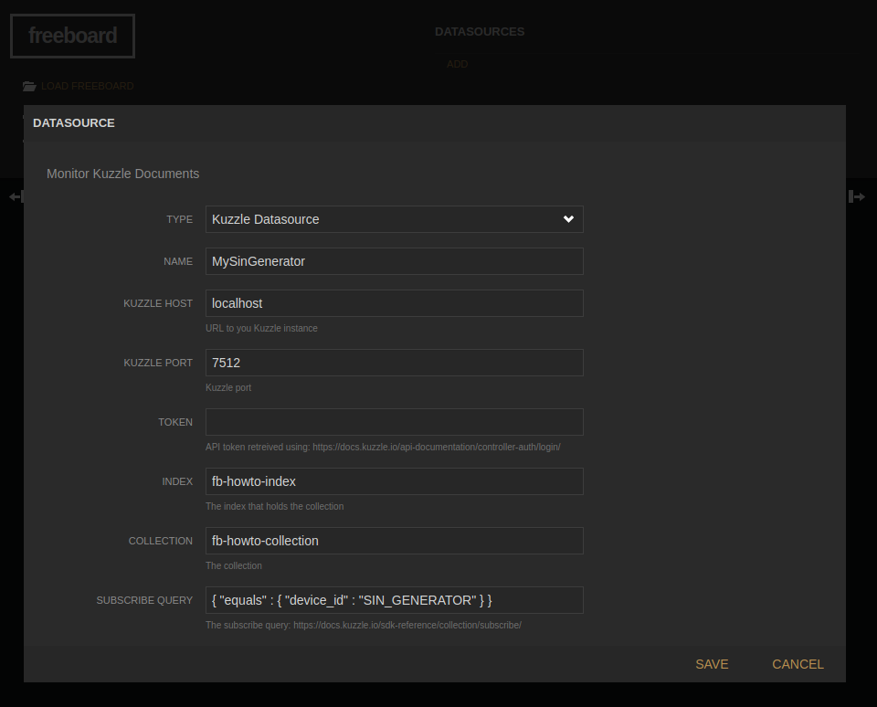

# How to create a realtime IoT dashboard for Kuzzle

## Table of Contents

<!-- TOC -->

- [How to create a realtime IoT dashboard for Kuzzle](#how-to-create-a-realtime-iot-dashboard-for-kuzzle)
    - [Table of Contents](#table-of-contents)
    - [Purpose](#purpose)
    - [Prerequisite](#prerequisite)
    - [How-to steps](#how-to-steps)
        - [Step 0: Getting Kuzzle Ready](#step-0-getting-kuzzle-ready)
        - [Step 1: Enable Kuzzle Datasource Plugin](#step-1-enable-kuzzle-datasource-plugin)
        - [Step 2: Kuzzle Datasource Configuration](#step-2-kuzzle-datasource-configuration)
        - [Step 3: Adding datasource for the SIN_GENERATOR device](#step-3-adding-datasource-for-the-sin_generator-device)
        - [Step 4: Adding a widget to visualize data from SIN_GENERATOR device](#step-4-adding-a-widget-to-visualize-data-from-sin_generator-device)
        - [Step 5: Adding other devices](#step-5-adding-other-devices)
    - [Conclusion](#conclusion)

<!-- /TOC -->

## Purpose

The purpose of this how-to is to learn how to create a real-time visualization for [Kuzzle](http://www.kuzzle.io) by adding a simple plugin to [freeboard](http://freeboard.io), an open source dashboard.

We will be using:

- an instance of *Kuzzle* running locally
- Kuzzle Freeboard Datasource plugin available on github: [http://github.com/kuzzleio/kuzzle-freeboard-plugin](http://github.com/kuzzleio/kuzzle-freeboard-plugin)
- *freeboard* running locally

We will be demonstrating how to use Kuzzle Freeboard Datasource plugin to monitor IoT devices. The IoT devices will be simulated by two scripts that will generate data in the way real IoT devices would. One will generate a sinus function, while the other will generate a square function.

## Prerequisite

To follow this how-to, you will need:

- to have an instance of **Kuzzle** up and running on your computer. Refer to the *Running Kuzzle* section of this guide to install **Kuzzle**: [https://docs.kuzzle.io/](https://docs.kuzzle.io/)

- Get **freeboard** from github:

```bash
$ git clone https://github.com/Freeboard/freeboard.git
```

- Install **freeboard**

```bash
$ cd freeboard && npm install
```

- Get Kuzzle Feeboard Datasource plugin

```bash
$ git clone https://github.com/kuzzleio/kuzzle-freeboard-plugin.git
```

We recommend that you clone both repositories into the same folder 
so that your directory tree matches this how-to.
You should end up with a folder containing the following subfolders:

```bash
.
├── freeboard
└── kuzzle-freeboard-plugin
```

## How-to steps

### Step 0: Getting Kuzzle Ready

Assuming you already have an intance of Kuzzle running on *localhost*, you will need to create a new *index* and *collection*.

In `scripts` folder, you can launch `fb-kuzzle-fixtures.sh` to create the required data structure. This will create an `fb-howto-index` index, and `fb-howto-collection` as shown below.


### Step 1: Enable Kuzzle Datasource Plugin

First we have to make Kuzzle Javascript SDK available to *freeboard* plugins.
One way to do this, is to import the *kuzzle-sdk* module into *freeboard*, using *npm*.

In `freeboard` folder enter the following command:

```bash
$ npm install kuzzle-sdk
```

Then modify `freeboard/index-dev.html` file to add loading of Kuzzle Javascript SDK, and Kuzzle DataSource plugin.

``` html
    <script type="text/javascript">
        head.js("lib/js/thirdparty/knockout.js",
                "lib/js/thirdparty/jquery.js",
                "plugins/freeboard/freeboard.widgets.js",
                .
                .
                .
                "examples/plugin_example.js",

                // Make Kuzzle() available
                "node_modules/kuzzle-sdk/dist/kuzzle.js",
                // Load Kuzzle Datasource plugin
                "../kuzzle-freeboard-plugin/kuzzle_datasource.js",

                // *** Load more plugins here ***
                function(){
                    $(function()
                    .
                    .
```

You can now check that Kuzzle DataSource plugin is available. Open `freeboard/index-dev.html` in your favorite web browser.
Under *DATASOURCES*, click the *ADD* button. In the dropdown list, you should be able to see **Kuzzle Datasource** entry.


### Step 2: Kuzzle Datasource Configuration

Once you clicked on **Kuzzle Datasource** entry, you see the plugin settings screen.



Settings:

| Name | Description |
|----------------------|------|
| Kuzzle host  | The hostname of the machine *Kuzzle*  instance is running on, default is `localhost`. |
| Kuzzle port | The port through which Kuzzle Server is accessible, default is `7512` |
| Token | You can provide a token to be used if anonymous access has been removed. See [Kuzzle login API](https://docs.kuzzle.io/core/2/api/controllers/auth/login/) to learn how to generate a JWT encrypted token |
| Index | The Kuzzle *index* that holds the documents your are interested in. |
| Collection | The Kuzzle *collection* that holds the documents your are interested in. |
| Filter | The filter the document you are interested in must match. Refer [Koncord documentation](https://docs.kuzzle.io/core/2/guides/cookbooks/realtime-api/introduction/) for further information about Kuzzle realtime filters.|

The Kuzzle Datasource plugin will receive a notification each time a document is **created** in the specified `index/collection` that matches the `filter`.

For the  purpose of this how-to, we will leave `Kuzzle host` and `Kuzzle port` to their default value, e.g. *`localhost`* and *`7512`*

We will set the `index` and `collection` settings to *`fb-howto-index`* and *`fb-howto-collection`* respectively. If you didn't create those yet, please refer to [Step 0: Getting Kuzzle Reading](#step-0-getting-kuzzle-reading) section.

### Step 3: Adding datasource for the SIN_GENERATOR device

The `sin-generator-device.sh` scipt, that you can find in `scripts` folder, will emulate a device that creates documents of the following form:

```json
{
    "device_id": "SIN_GENERATOR",
    "value": 0
}
```

Launching `sin-generator-device.sh` will start creating documents in Kuzzle. You should be able to see the documents using *Kuzzle Admin Console*


To monitor this device's *value* field, in *freeboard*, we will create a datasource that will monitor documents in `fb-howto-index/fb-howto-collection` and subscribe to documents for which the `device_id` field equals *`SIN_GENERATOR`*

In *freeboard*, under **DATASOURCES**, click the **ADD** button, choose Kuzzle Datasource. Enter settings as explained in the previous section.

Now, for the filter, as we want to match only created documents whose `device_id` is *`SIN_GENERATOR`*, we will use the following filter:

```json
{
    "equals" : {
        "device_id": "SIN_GENERATOR"
    }
}
```

Give a name to this datasource: *MySinGenerator*

Click **SAVE**. *MySinGenerator* should now appear in your **DATASOURCES** and be updated regularly.

### Step 4: Adding a widget to visualize data from SIN_GENERATOR device

We will use the *Sparkline* widget to visualize the SIN_GENERATOR device `value` field.

- First add a new pane by clicking the **ADD PANE** button
- In the newly created pane, click the **+** button to add a new widget
- Select *Sparkline* widget
- Give a title to the widget: *My Sin Generator*
- In the `VALUE` field, enter *`datasources["MySinGenerator"]["value"]`*


Click **SAVE**

You should start visualizing the evolution of the `SIN_GENERATOR` device over time:


### Step 5: Adding other devices

The next step is to add data from another virtual data. You can use the `./square-generator-device.sh` that will generate a square function for a device with `device_id` set to *`SQUARE_GENERATOR`*

You can follow  steps 3 and 4 using *`SQUARE_GENERATOR`* in place of *`SIN_GENERATOR`*

Both scripts accept a argument that will be used as `device_id` field in the created document, allowing to simulate several differents generator devices.

```bash
$ ./square-generator-device.sh my_square_gen_id
Generating square function as "device_id" : my_square_gen_id
```


## Conclusion

Using [Kuzzle](http://www.kuzzle.io) Realtime capabilities, [Kuzzle Datasource freeboard plugin](http://www.github.com/kuzzleio/kuzzle-freeboard-plugin), and the correct [subscription](https://docs.kuzzle.io/sdk/js/7/getting-started/node-js/) filter, you are able to monitor/vizualize any realtime parametter of your Kuzzle based IoT application.

For now, Kuzzle Freeboard Datasource plugin is limited to monitoring document when they are **created**, but you could easily adapt it to monitor document when they are **updated**, **deleted**, or **published**.


[You can also see this on Github](https://github.com/kuzzleio/kuzzle-how-to/tree/master/monitor-iot-data-with-freeboard)